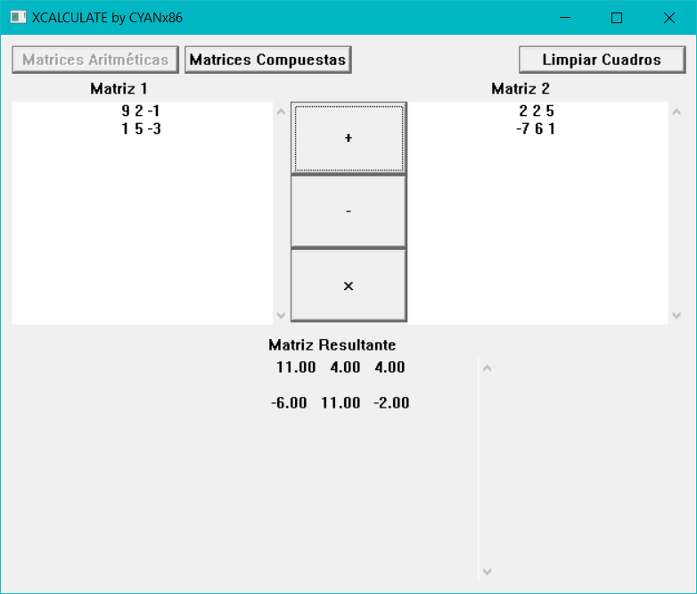
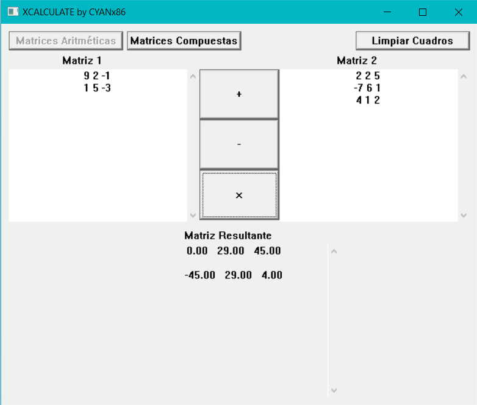

# XCALCULATE by CYANx86

XCALCULATE es una aplicación construida con las herramientas
gráficas de Windows. Permite realizar operaciones aritmeticas
con matrices y cálculos con matrices compuestas.

Por el momento se encuentra aún en desarrollo, las operaciones
con matrices compuestas aún estan pendientes. Las operaciones
aritméticas se encuentran en fase de prueba.

## ¿Cómo funciona la calculadora aritmética?

Escriba las matrices en los cuadros Matriz 1 y Matriz 2 siguiendo
las siguientes reglas:
* Separe columnas con espacios.
* Separe filas con saltos de renglón.
* Use caracteres numéricos (0 a 9).
* Puede usar puntos para números decimales.
* Puede usar signo negativo.

En medio de los cuadros Matriz 1 y Matriz 2 se encuentran los botones
de operaciones: Suma "+", Resta "-" y Producto "*".
Presione el botón de la operación que desea ejecutar.

Para la suma y resta, recuerde que el orden de las matrices debe ser igual
(misma cantidad de filas y columnas).

Para el producto de matrices, recuerde que la cantidad de columnas de matriz 1 debe ser
igual a la cantidad de filas de la matriz 2.

Como puede observar en las imagenes, el resultado de la operación se mostrará
en el cuadro Matriz Resultante.