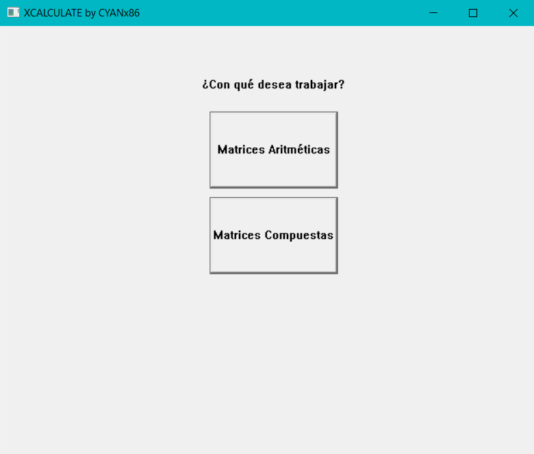
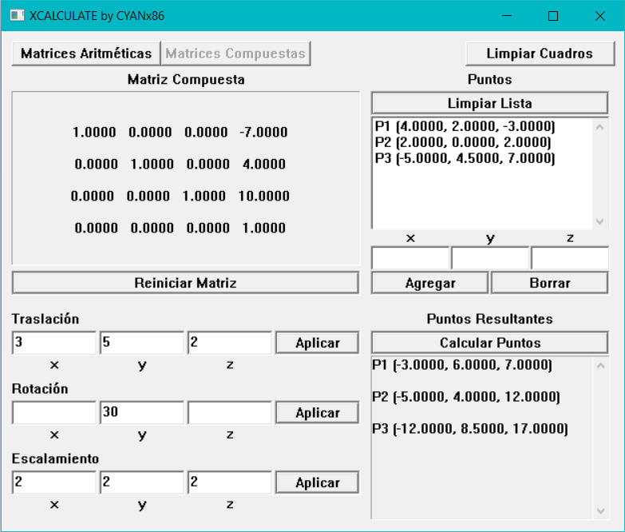

# XCALCULATE by CYANx86

XCALCULATE es una aplicación construida con las herramientas
gráficas de Windows. Permite realizar operaciones aritméticas
con matrices y cálculos con matrices compuestas para transformar
puntos.
Este proyecto fue realizado con fines de investigación y práctica,
si usted lo desea puede descargar el código fuente, observarlo,
analizarlo, modificarlo o mejorarlo. Este proyecto se considera
OPEN SOURCE.

## ¿Cómo funciona?

Al ejecutar la aplicación, observará este menú.

Seleccione la función con la que desea comenzar a trabajar.

### Función aritmética

Escriba las matrices en los cuadros "Matriz 1" y "Matriz 2" siguiendo
las siguientes reglas:
* Separe columnas con espacios.
* Separe filas con saltos de renglón.
* Use caracteres numéricos (0 a 9).
* Puede usar puntos para números decimales.
* Puede usar signo negativo.

En medio de los cuadros "Matriz 1" y "Matriz 2" se encuentran los botones
de operaciones: Suma "+", Resta "-" y Producto "x".
Presione el botón de la operación que desea ejecutar.

Para la suma y resta, recuerde que el orden de las matrices debe ser igual
(misma cantidad de filas y columnas).

Para el producto de matrices, recuerde que la cantidad de columnas de matriz 1 debe ser
igual a la cantidad de filas de la matriz 2.

Como puede observar en las imagenes, el resultado de la operación se mostrará
en el cuadro "Matriz Resultante".

Para borrar el contenido de todos los cuadros de texto, presione el botón "Limpiar Cuadros".

## Función Matriz Compuesta

### Transformar la matriz

La matriz compuesta inicia con ceros.
Para transformarla, ingrese las cantidades deseadas en la transformación.
* Para traslación, ingrese coordenadas de traslación para "x", "y" y "z".
* Para rotación solo puede realizar una rotación en un eje. Ingrese un ángulo para "x", "y" o "z".
* Para escalamiento, ingrese la magnitud de escala para "x", "y" y "z".

Para ejecutar la transformación, presione el botón "Aplicar" de la transformación deseada.

Si deja un espacio en blanco, este se tomará como cero.
Es importante recalcar que para rotación se tomará en cuenta el último numero ingresado
en caso de que haya escrito en más de un eje, pues solo se puede ejecutar una rotación
en un eje. Si necesita hacer multiples rotaciones, aplíquelas una por una y en orden.

Para deshacer todas las transformaciones aplicadas, es decir, inicializar la matriz compuesta en ceros,
presione "Reiniciar Matriz".

### Introducir los Puntos

Para añadir los puntos que se transformarán, ingrese sus coordenadas
en los recuadros correspondientes para "x", "y" y "z".
Presione "Agregar" para añadir el punto a la lista.

Para quitar un punto, seleccione el elemento de la lista y pulse "Borrar".

Si necesita vaciar la lista, presione "Limpiar Lista". Todos los puntos agregados
serán eliminados.

### Calcular

Para realizar el cálculo final de los puntos transformados, es necesario
haber transformado la matriz compuesta y tener al menos un punto agregado
en la lista de puntos. Presione "Calcular Puntos".

Los puntos transformados se mostrarán en el recuadro "Puntos Resultantes"
en el orden en los que fueron agregados a la lista.

Al presionar "Limpiar Cuadros", se reiniciará la matriz compuesta, la lista de puntos
se vaciará y el cuadro de Puntos Resultantes se limpiará para empezar con un nuevo
cálculo.